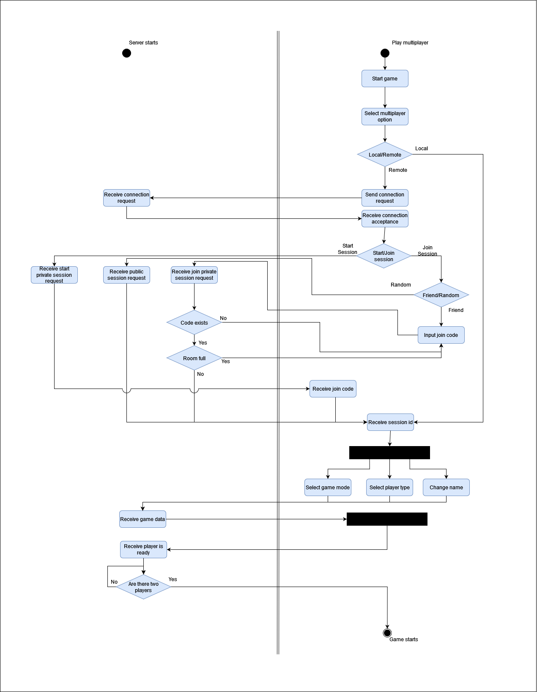

# PoliInvaders (Politehnica Invaders)

This is a project for our IS course (Software Engineering)

It was created using Unity Engine and C#.

    <image src = "https://www.svgrepo.com/show/331626/unity.svg" width = 200px height = 200px>
    <image src = "https://cdn.worldvectorlogo.com/logos/c--4.svg" width = 200px height = 200px>

# Authors:

- [Marius Tillinger 343](https://github.com/Marius-Tillinger)
- [Alexandru Balescu 344](https://github.com/Brioflator)
- [Andrei Harnagea 341](https://github.com/out-ruined69)
- [Moldoveanu Stefan 352](https://github.com/stefanmoldoveanu23)

# Epic Story:

In a hot summer day, while the students of FMI were looking over their textbooks and studying for the upcoming exams, a group of Politehnica students decided to invade the college. They were looking for a way to be true programmers and learn the ways of using other languages apart from ASM, C and C++. A brave student, who was working on his project for MDS decided to stop them so he can finish his project in peace. He asked for help from a CTI student because he needed high-tech gadgets to fight the invaders and went to the basement where he knew the battle will commence. 

# Product vision

# Features already delivered

# Product features and functionalities

# Integration points

- Point to the multiplayer server instance that shares data about players.
- Point to Firebase connection that stores leaderboard data.

# Roadmap

# Non-functional requirements

1. User host stops trying to connect to the server after a while. After 30 seconds of attempting to form a connection to the server host, the user host will render an error message indicating a failed connection attempt.
2. The game needs to run at a consistent framerate. The game should prioritize quickly processing the frame-by-frame data, in order to ensure a framerate of at least 30fps.
3. The multiplayer updates in real-time. The user host should send and request data from the server at least once for each rendered frame.

# Customer journey

## User personas

## User journey map

# Activity diagram

# User stories

## Done

1. As a user I need to start the game so that I can play it.
2. As a user I need to be able to move around my character so that I can have a better position.
3. As a user I need to be able to kill my enemies so that I can defend myself from them.
4. As a user I need to be able to dodge my enemies so that I can evade them more easily.
5. As a user I want to be able to see my scores so that I can see my skill progression.
6. As a user I need to know when I die so that I can retry.
7. As a user I need to be able to replay the game so that I don’t have to set up a new game.

## Sprint 1 + Acceptance Criterias

1. As a user I want to have access to an endless mode so that I can play without having to unlock each level every time.

2. As a user I want to have a choice in the type of gameplay(melee/ranged) so that I can play in a style I am more comfortable in.

- AC1: When a user starts a session, their gameplay type will be defaulted to melee. 
GIVEN there is no one else in the room 
WHEN the user starts a session 
THEN their gameplay type will be defaulted to melee. 

- AC2: When a user joins a session started by a different user, their type will be defaulted to the type that the first user doesn’t have.  
GIVEN there is someone else in the room 
WHEN the user joins a session 
THEN their gameplay type will be defaulted to the one unused. 

- AC3: A user can modify their gameplay type at will.  
GIVEN the user is playing melee/ranged 
WHEN the user presses a button to switch the gameplay type 
THEN their gameplay type will become ranged/melee. 

3. As a user I want to be able to unlock new levels so that there is a sense of progress.

- AC1: The first level is unlocked automatically. 
GIVEN there is at least one level 
WHEN the user starts a new save file 
THEN the first level will be automatically available to them.

- AC2: Error state: there are no levels. 
GIVEN there are no levels found 
WHEN the user starts a new save file 
THEN there will be an error displayed conveying as such.

- AC3: When the user finishes a level, the next one is unlocked. 
GIVEN there are more levels 
WHEN the user has finished a level 
THEN a new one is available to them.

- AC4: Final state: the user finishes the last level. 
GIVEN there are no more levels 
WHEN the user has finished a level 
THEN a congratulatory message is displayed to them.

4. As a user I want to have access to remote multiplayer so that I can enjoy the game with someone else.

- AC1: The user joins a multiplayer game. 
GIVEN there is a room with another user 
WHEN the user starts a multiplayer game 
THEN the user will join the room of the other user.

- AC2: The user joins a new room. 
GIVEN there is no other user waiting 
WHEN the user starts a multiplayer game 
THEN a new room will be created that the user will join.

5. As a user I want different save files so that I can start a new game without losing all progress.

- AC1: The user creates a new save file. 
GIVEN the game hasn’t reached the save file limit 
WHEN the user wants to create a new save file 
THEN the game will display a button that the user can press to create one.

## Final

1. As a competitive user I need to see the highscores so that I can compare myself to others.
2. As a user I want my score to be added to the leaderboard so that other people can see my accomplishments.
3. As a user I want to collect different power-ups so that I can feel more powerful.
4. As a user I want to customize my character so that its design feels more unique.
5. As a user I want the game to get more difficult so that I am always challenged.
6. As a user I want multiple types of enemies so that the gameplay doesn’t become stale.
7. As a user I want the game to feature mini-bosses/bosses so that levels have a sense of progress.
8. As a user I want to have access to local multiplayer so that I can enjoy the game with one of my friends.
9. As a user I want to be able to create a multiplayer room with a secret code so that I can restrict who can join me.

# Backlog

Trello link: https://trello.com/b/FBbVJ1XR/poliinvaders